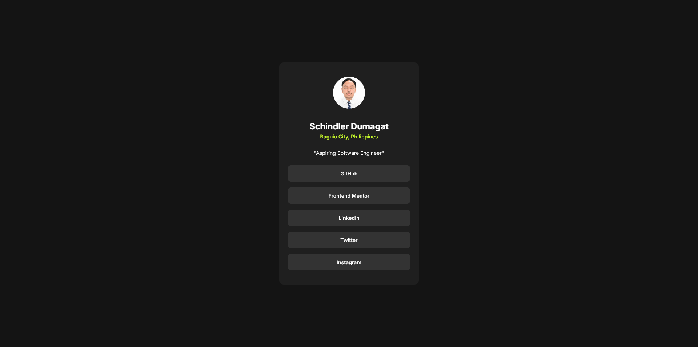

# Frontend Mentor - Social links profile solution

This is a solution to the [Social links profile challenge on Frontend Mentor](https://www.frontendmentor.io/challenges/social-links-profile-UG32l9m6dQ). Frontend Mentor challenges help you improve your coding skills by building realistic projects. 

## Table of contents

- [Overview](#overview)
  - [The challenge](#the-challenge)
  - [Screenshot](#screenshot)
  - [Links](#links)
- [My process](#my-process)
  - [Built with](#built-with)
  - [What I learned](#what-i-learned)
- [Author](#author)

## Overview

This project is my social links profile page that contains all my social links and other links that are relevant to my career. This is built using the mobile first approach. I also applied some hover effects on each link.

### The challenge

Users should be able to:

- See hover and focus states for all interactive elements on the page

### Screenshot



### Links

- Solution URL: [Add solution URL here](https://www.frontendmentor.io/solutions/responsive-social-links-profile-using-media-queries-with-animations-DmuQTJQxwV)
- Live Site URL: [Add live site URL here](https://schindlerdumagat.github.io/social-links-profile/)

## My process

For me to be able to follow the mobile first approach, I opened the dev tools and used the design toolbar at the top left of the dev tools and then scaled down the view to mobile size. From there, I started to code the project and when I am finished I scaled it up to tablet view and continue to scale it up to wider views until you are done building it with the desired screen sizes.

### Built with

- Semantic HTML5 markup
- CSS custom properties
- Flexbox
- Mobile-first workflow

### What I learned

In this project, I practiced how to implement responsive design and the mobile first approach. I learned how to use media queries for creating responsive websites.

```
@media screen and (min-width: 768px) {
    article {
        width: 456px;
        height: 611px;
    }
}

@media screen and (min-width: 1440px) {
    article {
        width: 384px;
    }
}

```

## Author

- Website - [Schindler C. Dumagat](https://schindlerdumagat.github.io/webportfolio/)
- Frontend Mentor - [@schindlerdumagat](https://www.frontendmentor.io/profile/schindlerdumagat)
- LinkedIn - [@schindlerdumagat](https://www.linkedin.com/in/schindler-dumagat-015238230/)
